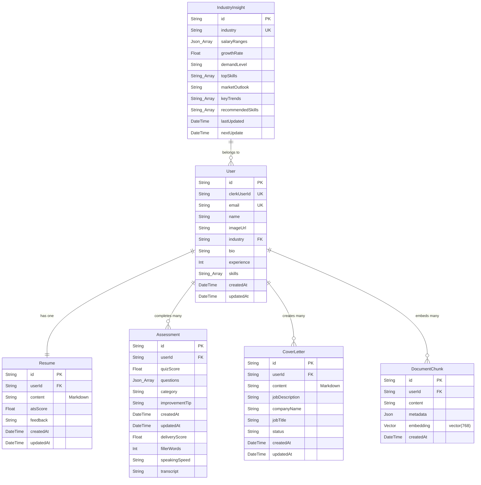

# JobMentorAI: Your AI-Powered Career Co-pilot 🚀

JobMentorAI is a premium, full-stack AI career coach application designed to empower job seekers and professionals. Built with **Next.js 15**, **Prisma ORM**, **Neon PostgreSQL (with pgvector)**, **Clerk**, **Inngest**, and a **Resilient Multi-Provider AI Cascade (Gemini, Groq, OpenAI)**, the platform offers RAG-grounded intelligent tools like an AI Resume Builder & ATS Tailor, Live Job Search Hub, Multimodal Speech Coach, Automated Cover Letter Generator, Mock Interview Simulator, and a Dynamic Industry Insights Dashboard.

---

## 📋 Table of Contents
1. [Key Features](#-key-features)
2. [RAG (Retrieval-Augmented Generation) Architecture](#-rag-retrieval-augmented-generation-architecture)
3. [Multi-Provider AI Fallback Engine](#-multi-provider-ai-fallback-engine)
4. [Tech Stack & System Architecture](#-tech-stack--system-architecture)
5. [Complete Project Folder Structure](#-complete-project-folder-structure)
6. [Database Schema & Models](#-database-schema--models)
7. [Getting Started (Local Installation)](#-getting-started-local-installation)
8. [Background Jobs & Automation](#-background-jobs--automation)
9. [License](#-license)

---

## ✨ Key Features

### 🧠 Platform-Wide RAG (Retrieval-Augmented Generation)
- **768-Dimensional Vector Embeddings:** Uses `gemini-embedding-001` and Neon PostgreSQL `pgvector` to embed user documents, master resumes, and career profile data.
- **RAG-Grounded Outputs Across 6 Core Tools:** Grounded generation for AI Career Advisor, Cover Letters, ATS Resume Tailor, Mock Interviews, Resume Summaries, and Skill Recommendations.

### 💼 Live Job Openings & Multi-Platform Direct Apply Hub
- **Real-Time Public API Integrations:** Fetches genuine live job postings directly from **Remotive Live Jobs API** and **Jobicy Live Jobs API**.
- **1-Click Direct Apply Links:** Direct links to original employer postings with visual `⚡ Live Opening` indicators.
- **Multi-Platform Search Shortcuts:** Pre-filled search launchers for **LinkedIn Jobs**, **Indeed**, **Wellfound (AngelList)**, **Google Jobs**, **Glassdoor**, and **RemoteOK**.
- **Smart Region & Job Filters:** Tokenized keyword search matching and region filtering (*Remote, USA, Europe, Asia*).

### 🗣️ Multimodal AI Speech Coach & Practice Hub
- **Category-Based Voice Prompts:** Practice interview questions across **Behavioral (STAR)**, **Technical Deep Dive**, **Leadership & Conflict**, and **Problem Solving**.
- **Custom Question Input:** Type or paste any custom interview prompt to practice speaking out loud.
- **Dynamic AI Question Generator:** Generates infinite, role-tailored speech prompts on demand.
- **In-Browser Audio Playback & Analytics:** Record audio responses, listen back to voice recordings, and review metrics for **Content Score**, **Delivery Articulation**, **Filler Word Count** (`um`, `uh`, `like`), **Pacing (WPM)**, and **Transcription**.

### ⚡ AI Resume Builder & Saved Resumes Dashboard
- **Executive Single-Page A4 Layout:** High-density, recruiter-ready resume paper styling designed to fit strictly on 1 A4 page.
- **Saved Resume Dashboard:** Edit saved resumes in the form builder (pre-populating Experience, Education, Projects, Skills, and Contact Info) or download PDF directly.
- **Interactive Degree & Branch Dropdowns:** Degree selects (B.Tech, M.Tech, BCA, MCA, BS, MS, Diploma) and branch selections for education entries.

### 🎯 Smart AI Resume Tailor & ATS Optimizer
- **Authentic ATS Optimization:** Upload existing resume PDFs and target job descriptions to generate tailored, keyword-aligned resumes.
- **Strict Integrity Guardrails:** Rephrases bullet points and emphasizes real accomplishments without fabricating fake jobs or unearned degrees.
- **Match Compatibility Boost:** Visual ATS compatibility card showing original vs tailored match score (e.g. 58% ➔ **95% ATS Match**).

### 🔍 ATS Audit Scanner & AI Wave Scanner
- **ATS Compatibility Audit:** Real-time checks highlighting missing keywords, formatting caveats, and recommended bullet rewrites.
- **Interactive Wave Equalizer:** Animated sonar radar core and data wave equalizer.

### ✍️ RAG-Powered Cover Letter Generator
- RAG-enhanced cover letter creation incorporating verified accomplishments retrieved from candidate vector embeddings.

### 📈 Interactive Role & Industry Insights Hub
- On-demand role search (*Full-Stack AI Engineer, Cloud Architect*), interactive skill bridges, and 30-60-90 day career progression roadmaps.

---

## 🧠 RAG (Retrieval-Augmented Generation) Architecture

JobMentorAI uses a centralized RAG retrieval helper (`lib/rag-helper.js`) powered by Google's `gemini-embedding-001` and Neon PostgreSQL `pgvector`:

```
[User Document / Query] ➔ 1. gemini-embedding-001 (768-dim Vector)
                                    │
                                    ▼
                         2. Neon PostgreSQL (pgvector)
                         Cosine Similarity Query (1 - (embedding <=> query::vector))
                                    │
                                    ▼
                         3. Context Injected Prompt
                         Grounded Output Across 6 Core Platform Tools
```

### 6 RAG-Grounded Tools:
1. 💬 **AI Career Advisor & Document Knowledge Base** ([actions/rag.js](file:///Users/sivansrawat/Documents/Job-Mentor-AI/actions/rag.js))
2. ✍️ **Cover Letter Generator** ([actions/cover-letter.js](file:///Users/sivansrawat/Documents/Job-Mentor-AI/actions/cover-letter.js))
3. 🎯 **Smart ATS Resume Tailor** ([actions/resume-tailor.js](file:///Users/sivansrawat/Documents/Job-Mentor-AI/actions/resume-tailor.js))
4. 📝 **Technical & Behavioral Mock Interview Quiz** ([actions/interview.js](file:///Users/sivansrawat/Documents/Job-Mentor-AI/actions/interview.js))
5. ⚡ **AI Resume Summary Generator** ([actions/resume-generator.js](file:///Users/sivansrawat/Documents/Job-Mentor-AI/actions/resume-generator.js))
6. 💡 **AI Skill Recommender** ([actions/resume-generator.js](file:///Users/sivansrawat/Documents/Job-Mentor-AI/actions/resume-generator.js))

---

## 🤖 Multi-Provider AI Fallback Engine

JobMentorAI includes a multi-provider LLM cascade runner ([lib/ai-provider.js](file:///Users/sivansrawat/Documents/Job-Mentor-AI/lib/ai-provider.js)) that handles rate limits (HTTP 429) and quota caps:

```
[User Request] ➔ 1. Google Gemini (gemini-2.5-flash)
                    │ (If Rate Limited / HTTP 429)
                    ▼
                 2. Groq API (llama-3.3-70b-versatile)
                    │ (If Quota Exceeded / Error)
                    ▼
                 3. OpenAI API (gpt-4o-mini)
```

---

## 🏗️ Tech Stack & System Architecture

### Frontend
* **Framework:** Next.js 15 (App Router, Server Components)
* **Styling:** Tailwind CSS, Shadcn UI, CSS variables, Dark/Light modes via `next-themes`
* **Markdown & PDF:** React Markdown, `@uiw/react-md-editor`, HTML2PDF exporter
* **Charts:** Recharts for salary and market trend analytics

### Backend & Database
* **Database & ORM:** Neon PostgreSQL with `pgvector` vector extension & Prisma ORM
* **Authentication:** Clerk Auth with path protection middleware
* **Background Jobs:** Inngest event-driven worker & weekly cron scheduler
* **Live Job APIs:** Remotive REST API & Jobicy REST API

---

## 📁 Complete Project Folder Structure

```
Job-Mentor-AI/
├── actions/                         # Next.js Server Actions
│   ├── cover-letter.js              # RAG Cover Letter CRUD & generation
│   ├── dashboard.js                 # Industry market insights & custom role search
│   ├── interview.js                 # RAG Technical interview quiz generator
│   ├── jobs.js                      # Live job openings fetcher (Remotive + Jobicy)
│   ├── rag.js                       # RAG context ingestion & AI advisor chat
│   ├── resume-generator.js          # RAG AI summary & skill suggester
│   ├── resume-scanner.js            # ATS audit scanner & wave analysis
│   ├── resume-tailor.js             # RAG Smart ATS resume tailoring
│   ├── resume.js                    # Resume CRUD & markdown parser
│   ├── speech.js                    # Multimodal speech coach & AI question generator
│   └── user.js                      # Onboarding & user profile management
├── app/                             # Next.js App Router Core
│   ├── (auth)/                      # Authentication Route Group
│   │   ├── layout.js                # Auth page wrapper
│   │   ├── sign-in/                 # Clerk Sign-In route
│   │   └── sign-up/                 # Clerk Sign-Up route
│   ├── (main)/                      # Protected Main App Module Routes
│   │   ├── advisor/                 # RAG AI Career Advisor Chat
│   │   │   └── page.jsx             # AI Advisor semantic chat UI
│   │   ├── ai-cover-letter/         # Cover Letter Workspace
│   │   │   ├── [id]/page.jsx        # Individual cover letter view page
│   │   │   ├── _components/         # Cover letter generator & preview components
│   │   │   │   ├── cover-letter-generator.jsx
│   │   │   │   ├── cover-letter-list.jsx
│   │   │   │   └── cover-letter-preview.jsx
│   │   │   ├── new/page.jsx         # New cover letter generation route
│   │   │   └── page.jsx             # Cover letter history dashboard
│   │   ├── dashboard/               # Industry Insights Dashboard
│   │   │   ├── _component/          # Dashboard analytics view component
│   │   │   │   └── dashboard-view.jsx
│   │   │   ├── layout.js            # Dashboard layout wrapper
│   │   │   └── page.jsx             # Main dashboard route
│   │   ├── interview/               # Interview Preparation Hub
│   │   │   ├── _components/         # Performance chart & quiz UI components
│   │   │   │   ├── performace-chart.jsx
│   │   │   │   ├── quiz-list.jsx
│   │   │   │   ├── quiz-result.jsx
│   │   │   │   ├── quiz.jsx
│   │   │   │   └── stats-cards.jsx
│   │   │   ├── layout.js            # Interview layout wrapper
│   │   │   ├── mock/page.jsx        # Quiz execution page
│   │   │   ├── page.jsx             # Interview dashboard main page
│   │   │   └── speech/page.jsx      # Multimodal AI Speech Coach UI
│   │   ├── jobs/                    # Live Job Openings & Direct Apply Hub
│   │   │   ├── _components/         # Interactive job list & platform apply links
│   │   │   │   └── job-list.jsx
│   │   │   └── page.jsx             # Job search main route
│   │   ├── layout.jsx               # Protected routes layout container
│   │   ├── onboarding/              # User Profile Onboarding Flow
│   │   │   ├── _components/         # Onboarding form step component
│   │   │   │   └── onboarding-form.jsx
│   │   │   └── page.jsx             # Onboarding page route
│   │   └── resume/                  # Resume Builder Workspace
│   │       ├── _components/         # Resume builder & scanner components
│   │       │   ├── ats-scanner.jsx  # ATS scanner & wave equalizer
│   │       │   ├── entry-form.jsx   # Form entry cards with edit buttons
│   │       │   ├── resume-builder.jsx # Resume builder & strength meter
│   │       │   ├── resume-list.jsx  # Saved resumes list & PDF export
│   │       │   ├── resume-preview.jsx # Styled single-page A4 live preview
│   │       │   └── resume-tailor.jsx  # Smart ATS resume tailor component
│   │       └── page.jsx             # Main resume builder page
│   ├── api/
│   │   └── inngest/route.js        # Inngest background event router
│   ├── lib/                         # App level validation & helper scripts
│   │   ├── helper.js                # Markdown parser & date converters
│   │   └── schema.js                # Zod validation schemas
│   ├── actions.js                   # Application server utilities
│   ├── globals.css                  # Global Tailwind CSS & executive paper styling
│   ├── icon.png                     # Custom project favicon icon
│   ├── layout.js                    # Root application layout
│   ├── not-found.jsx                # Custom 404 page
│   └── page.js                      # Landing page UI
├── components/                      # Shared UI Components
│   ├── ui/                          # Shadcn UI primitive components
│   │   ├── accordion.jsx, alert-dialog.jsx, badge.jsx, button.jsx, card.jsx
│   │   ├── dialog.jsx, dropdown-menu.jsx, input.jsx, label.jsx, progress.jsx
│   │   ├── radio-group.jsx, select.jsx, sonner.jsx, tabs.jsx, textarea.jsx
│   ├── header.jsx                   # Top navigation navbar & Growth Tools menu
│   ├── hero.jsx                     # Landing page hero section
│   └── theme-provider.jsx           # Dark/light mode theme provider
├── data/                            # Static Platform Marketing & Industry Data
│   ├── faqs.js                      # FAQ items list
│   ├── features.js                  # Landing page feature cards
│   ├── howItWorks.js                # Workflow steps data
│   ├── industries.js                # Industry taxonomy data
│   └── testimonial.js               # User testimonial data
├── hooks/                           # Custom React Hooks
│   └── use-fetch.js                 # Custom server action fetch hook
├── lib/                             # Core Backend Infrastructure Clients
│   ├── inngest/                     # Inngest worker client & cron jobs
│   │   ├── client.js                # Inngest client initialization
│   │   └── function.js              # Weekly cron functions
│   ├── ai-provider.js               # Multi-Provider AI Fallback Cascade Engine
│   ├── checkUser.js                 # Clerk-to-Prisma user sync utility
│   ├── prisma.js                    # Prisma client singleton
│   ├── rag-helper.js                # Shared Vector RAG Engine (pgvector)
│   └── utils.js                     # Tailwind class merge utility
├── prisma/                          # Database Configuration & Migrations
│   ├── migrations/                  # Database schema migration history
│   └── schema.prisma                # Prisma schema with DocumentChunk pgvector model
├── public/                          # Static Web Assets & Favicon
│   ├── banner.jpeg, banner2.jpeg, banner3.jpeg, favicon.ico, logo.png
├── middleware.js                    # Clerk auth route protection middleware
├── next.config.mjs                  # Next.js bundler configuration
├── package.json                     # Node.js dependencies & scripts
├── postcss.config.mjs               # PostCSS tailwind compiler settings
├── tailwind.config.mjs              # Tailwind CSS design system theme settings
└── vercel.json                      # Vercel serverless function configuration
```

---

## 🗄️ Database Schema & Models



---

## 🛠️ Getting Started (Local Installation)

### 1. Prerequisites
- Node.js (v18 or higher)
- Neon PostgreSQL database instance with `pgvector` extension enabled
- Clerk Authentication account
- API Keys: Google Gemini API Key (`GEMINI_API_KEY`), Groq API Key (`GROQ_API_KEY`), OpenAI API Key (`OPENAI_API_KEY`)

### 2. Installation Steps
```bash
# Clone the repository
git clone https://github.com/SivansRawat/JobMentorAI.git
cd JobMentorAI

# Install dependencies
npm install

# Configure environment variables
cp .env.example .env

# Push database schema & generate Prisma client
npx prisma generate
npx prisma db push

# Start development server
npm run dev
```

Open `http://localhost:3000` in your browser.

---

## ⏳ Background Jobs & Automation

Uses **Inngest** for automated background workflows:
1. **Weekly Market Insights Refresh (`cron: "0 0 * * 0"`):** Updates salary benchmarks, growth rates, and skill trends every Sunday at midnight.
2. **Weekly Market Pulse Digest (`cron: "0 9 * * 1"`):** Dispatches weekly email reports to users via Resend API every Monday at 9:00 AM.

---

## 📄 License

Distributed under the MIT License. See `LICENSE` for details.
